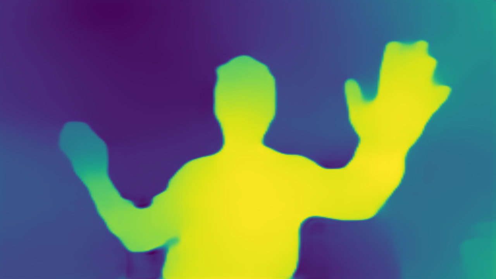

# Monodepth Estimation with OpenVINO

This project implements a **monodepth estimation** pipeline using OpenVINO for inference on a CPU. The application captures live video from the camera, processes each frame to estimate depth, and generates a heatmap representing the distances between objects and the camera.

## How It Works

This program performs real-time depth estimation and visualization by:

- **Estimating Depth**: Using a pretrained MiDaS model, the application calculates the depth of objects in the camera’s field of view.
- **Creating a Heatmap**: The depth information is transformed into a color-coded heatmap, making it easy to visually interpret the relative distances of objects.
- **Optimizing Inference on CPU**: By leveraging OpenVINO, the application runs efficiently on a CPU, making it suitable for use in embedded systems and environments with limited resources.

 

## Requirements

- Python 3.x
- OpenVINO
- OpenCV
- NumPy
- Requests

Install the required packages with:
```bash

# Step 1: Create virtual environment
python3 -m venv openvino_env
# Step 2: Activate virtual environment
source openvino_env/bin/activate
# Step 3: Upgrade pip to latest version
python -m pip install --upgrade pip
# Step 4: Download and install the package
pip install 'openvino==2024.4.0'
pip install 'opencv-python==4.10.0.84'
pip install 'requests==2.32.3'
```

## Contact

- **Author**: Alan Pipitone
- **Email**: alan.pipitone@gmail.com

Please only contact me if you encounter **serious** issues with the code.

If you're looking to hire someone for **innovative Python projects**, feel free to reach out — I won't mind! 😄

## Open to Job Opportunities

I am actively seeking **Python development opportunities**, especially in the fields of backend development, machine learning, and computer vision. Shoot me an email if you're interested in collaborating on **cool and innovative projects**!
